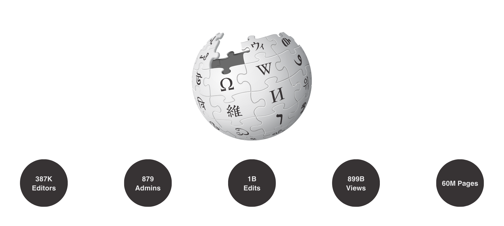
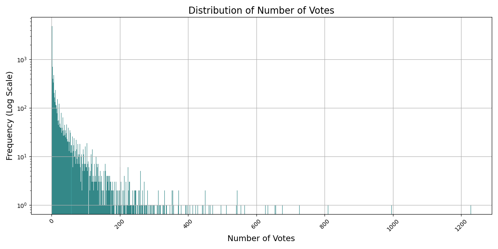
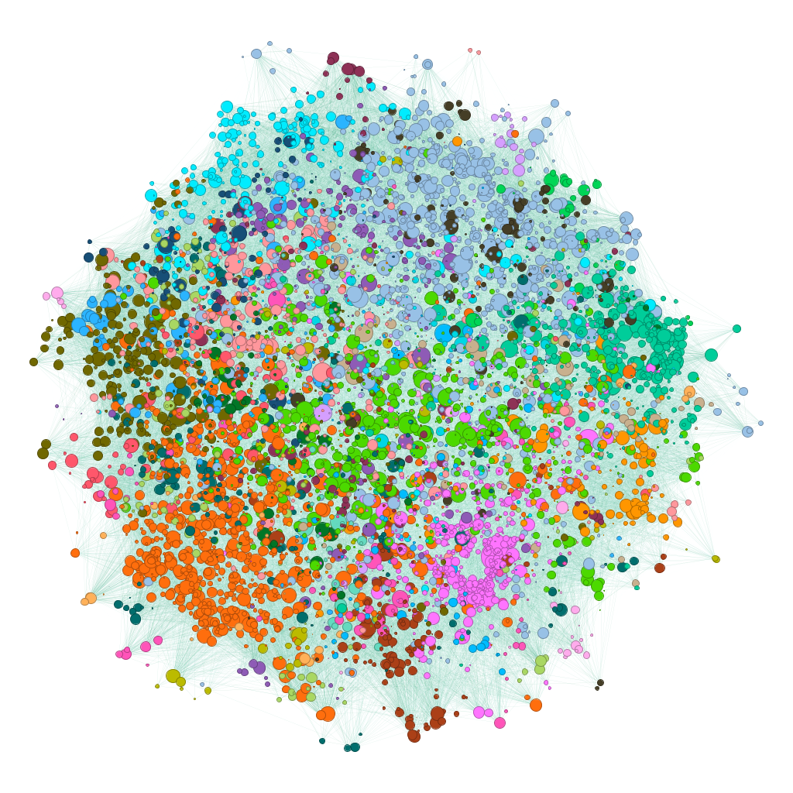
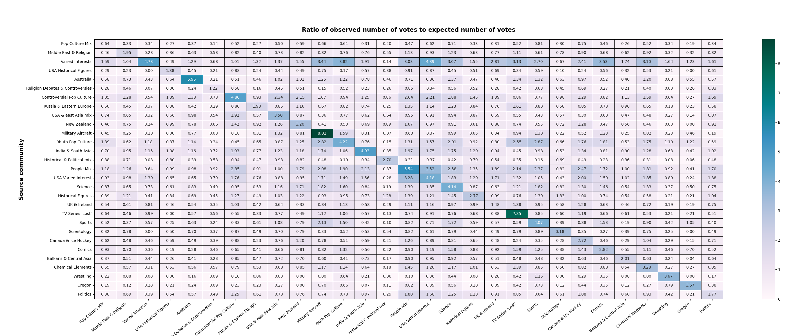
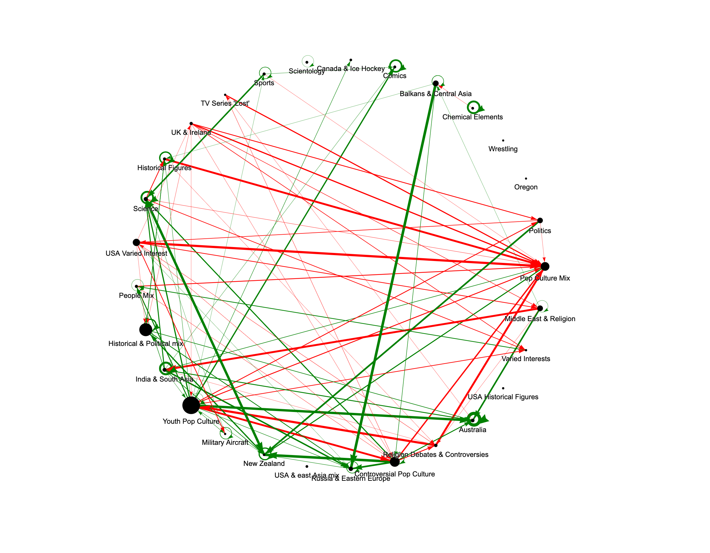

# Background and motivation

Wikipedia, the world's largest online encyclopedia, relies on a community of dedicated contributors to maintain and improve its vast repository of knowledge. Admins (short for administrators) play a crucial role in this ecosystem by overseeing the platform, ensuring its integrity, and facilitating a collaborative and respectful environment for editors. The process through which individuals become administrators is known as the Request for Adminship (RfA). Adminship is not just a privilege but a responsibility, and those seeking this role are expected to have a deep understanding of Wikipedia policies, guidelines, and a history of constructive contributions. All the admins have the ability to delete pages, protect pages from editing, and block users, among other tools. Those tasks necessitate a high level of trust from the community, hence, the importance of robust votation in Wikipedia's administrative elections cannot be overstated. They need to ensure a fair and equitable system. A diverse voter base ensures a variety of perspectives, mitigating the risk of undue influence or bias. In short, the votation process is a crucial mechanism for upholding fairness, transparency, and community consensus.

In an ideal world, candidates should be driven by a commitment to actively engage in the governance structure of Wikipedia. On the other side, voters, like Bob, should have for objective to 
ensure that candidates are selected based on their merit, experience, and dedication to the fundamental principles of Wikipedia. However, from 2003 to 2013, there was an **average of 53 votes** per election out of the millions of registered users[^1] allowed to vote. This low turnout raises questions about the fairness and integrity of the system.

[^1]: Wikimedia, number of registered users 2003-2013, https://stats.wikimedia.org/#/en.wikipedia.org

In this data story, we aim to address the following questions:

- Is the election process as fair as it should ideally be?
- What drives people to vote?
- How could the Wikipedia democratic process be improved?

Our aim is to investigate the factors influencing participation and identify the challenges that arise from the low engagement rate. Based on our research, we intend to propose solutions to increase the participation rate.

Before we dive into the data, let me introduce you to Bob. Bob is an avid Wikipedia user. Having spent countless hours contributing to Wikipedia articles, he is now considering applying to become admin. However, he's a careful observer who wants to maximize his chance of being elected. Hence, he wants to know more about the voting habits before applying.

Throughout our data story, Bob will serve as our guide, asking important questions about the election process, voter motivations, and potential improvements. So, let's join Bob on his journey of exploration and discovery.

# The data used

## Wikipedia Requests for Adminship (Wiki-RfA)

Our main dataset, the [Wiki-RfA](https://snap.stanford.edu/data/wiki-RfA.html)[^2], spans from 2003 to 2013, and includes a collection of 11,381 users involved in RfA processes, resulting in 189,004 unique voter/votee pairs and 198,275 votes. This dataset offers a detailed view of Wikipedia's community dynamics, reporting each vote, election outcome, and user comment.

[^2]: Robert West, Hristo S. Paskov, Jure Leskovec, and Christopher Potts: Exploiting Social Network Structure for Person-to-Person Sentiment Analysis. Transactions of the Association for Computational Linguistics, 2(Oct):297–310, 2014.

## Complete Wikipedia Edit History (Up to Jan 2008)
Our second dataset, the [Complete Wikipedia Edit History](https://snap.stanford.edu/data/wiki-meta.html)[^3], provide a complementary perspective. This dataset is a vast repository containing several terabytes of text, capturing the entire edit history of Wikipedia articles up to January 2008. It is divided into several components, showcased in the following table, each representing different facets of Wikipedia.

| File                           | Description                         | Size (compressed) |
| ------------------------------ | ----------------------------------- | ----- |
| Main Namespace Revisions       | Core Wikipedia articles             | 8Gb   |
| Talk Namespace Edits           | Article discussion pages            | <1 GB |
| User Page Revisions            | User personal pages                 | <1 GB |
| User Talk Page Edits           | User discussion pages               | <1 GB |
| Wikipedia Namespace            | Administrative procedures and pages | 3Gb   |
| Wikipedia Namespace Talk Pages | Administrative discussion pages     | <1 GB |

In this project, the focus was on the Main Namespace Revisions and User Talk Page Edits to track and analyze user interactions. The former enables us to consider interactions between users outside of the election process. We consider an interaction between two users as an edit from one user to another user’s talk page (a personal page used to discuss with other editors). Those interactions reflect direct, personal and conscious interactions. This allows us to link voters and candidates outside of the elections, to identify who has had interactions. The latter comprises the edits on different Wikipedia pages. From that, we can gather information on the centers of interest of the users.

[^3]: J. Leskovec, D. Huttenlocher, J. Kleinberg. Governance in Social Media: A case study of the Wikipedia promotion process. AAAI International Conference on Weblogs and Social Media (ICWSM '10), 2010.

# Datasets Exploratory Data Analysis
Our dataset is not just a collection of numbers, it is a reflection of the motivations and actions of voters within the RfA process. As we want to dive into the complexity of voting behavior in RfA elections. We first question ourselves about the behavior of the voters. Do people vote a lot? Do they vote positively or negatively?
First, we see here that we have a really important proportion of positive votes in our dataset.

<iframe src="assets/html/vote_distrib.html" width="750px" height="550px" frameborder="0" position="relative">Genre plot</iframe>

However, we see that the voting behavior of users is extremely imbalanced. We have an important part of the users who vote only once. The distribution has a large tail, some of the users voted 200, 400, 600 and even one voted 1200 times ! This phenomena is starting to interest Bob, as Bob is planning on running for an RfA he would like to know why so few people vote? 

Before answering Bob, we should first explore further analysis regarding the elections.
We said before that the majority of votes are positive. Great! If the majority of votes are positive, the majority of elections are successful so Bob has a high chance of becoming an admin! Hum, hum …

<iframe src="assets/html/nb_votes_outcome.html" width="750px" height="550px" frameborder="0" position="relative">Genre plot</iframe>

Election outcomes are very well balanced between success and failure. By following the duration of 7 days for election, as indicated by [wikipedia RfA’s guide](https://en.wikipedia.org/wiki/Wikipedia:Requests_for_adminship#About_RfB), we obtain more unsuccessful elections than successful ones. Why? Actually elections only get successful when an important majority of the votes are positive, around 80%!
Bob begins to feel disheartened as the majority of elections do not yield successful outcomes, many voters appear disengaged from the process, and to add to his challenges, Bob still needs to persuade a significant portion of the electorate.
Here is some relief: what this plot shows is that, among the users who end up getting elected, most of them do it on their first election. However, assiduity can pay off as some wait as many as 6 elections before getting elected! 
Wikipedia RfA is a lot about perseverance, 40% of the users who run for an election give up after an unsuccessful first election! So Bob is now quite relieved but still a question torments him : How can he influence the result of his election? Let’s dig into it!

<iframe src="assets/html/number_elections_per_person.html" width="750px" height="550px" frameborder="0" position="relative">Genre plot</iframe>

# Elections Dynamics
## Individual perspectives in RfA Elections
We already saw that users don’t vote much and on average they participate in 18 distinct RfA’s during their Wikipedia user’s life. Something even more surprising is that the majority of the users take around 70 days between each of their votes. Users are not very active… But as they are a key player in Bob’s RfA, he wants to know what he could do to influence the outcome of his election.

What drives people to take part in specific elections? 

As our dataset contains only votes of election, it is not particularly straightforward to know what influences the voters not to vote. To address this, we create a balanced dataset by pairing (for a given election) a voter and a non-voter that have similar voting statistics. Then we conduct a logistic regression, incorporating two key features: the number of contacts from the voter who voted before him and a binary variable representing contact between the voter and the person running for election[^4]. 
It turns out that the two features have coefficients XX for the first one and YY for the second one. The regression showed a pseudo R-squared of XX and a p-value of 0 for both our features. 
This is an important breakthrough for us as we have here two major key players that drive the participation of users. We should hurry to advise Bob to engage with more people in order to have more voters who participate in his election.

[^4]: Paper of Cabunducan, G. https://ieeexplore.ieee.org/document/5992657

What can influence the vote of a voter election? 				
			
A first intuition could be to say that interactions with users tend to influence the result of a vote as displayed by this graph, i.e the users with whom Bob interacts a lot will tend to vote positively in Bob’s interaction : 

<iframe src="assets/html/percentage_interactions.html" width="750px" height="550px" frameborder="0" position="relative">Genre plot</iframe>

We now conduct a different logistic regression to predict the value of the vote using two different features. The initial pair of features corresponds to the number of contacts who voted positively for the election (before our user) and the number of contacts who voted negatively before him. The second feature is a binary feature that represents that a  communication exists between the candidate and the voter.  
The two first features have coefficients XX for contacts with positive votes and XX for contacts with negative votes. The direct contact feature has a coefficient of YY. The regression showed a pseudo R-squared of XX and a p-value of 0 for all our features. 
All the coefficients align with our anticipations. What stands out is the notable predictive power of the user’s one-hop neighborhood in determining vote values. Surprisingly, the presence of contacts who voted negatively exerts more influence than those who voted positively. This reaffirms our earlier recommendation to engage with more people.

Bob now has a few insights on what he can do to improve his chances. However, as ambitious as Bob is, he wants to find other things that can improve his chances. A friend of his told him that Charlie has been elected by creating fake accounts and voting for himself.

Bob has gained some valuable insights into what he can do to improve his chances. However, fueled by his ambition, he wants to explore additional strategies that could boost his chances. A friend mentioned to him that Charlie secured an election by generating fake accounts and casting votes in his favor. He is now wondering whether such a practice is commonplace on Wikipedia.

This rumor raises great concerns about the election fairness. Indeed, a potential challenge to the fairness of elections is the use of fake accounts by candidates to artificially boost their support. This practice could be particularly effective given the low voter turnout. Not only does this undermine the fairness of the whole system, but it also casts doubt on the legitimacy of the entire election process. It is crucial to identify and address such malicious practices to ensure that meritocracy prevails, and every participant's voice carries equal weight.

To question the presence of fake accounts in the RfA election on Wikipedia, we filter the users of the dataset based on their votes and edits. Our primary focus was on identifying users exhibiting characteristics indicative of potential fraudulent activity.

- The criteria for identifying potential fake accounts are:
- No edits
- Single vote participation

If a user creates multiple accounts to artificially inflate positive votes, it's probable that they won't invest time in making edits with each account before casting a vote. Additionally, the user is likely to abandon most of these accounts, leaving them with zero edits and just one vote. Therefore, these straightforward characteristics serve as effective indicators to identify the use of fake accounts for vote manipulation.

To identify elections possibly influenced by a large number of fake accounts, we compute the ratio of such accounts (meeting both criteria simultaneously) participating in each election. The results indicate that these accounts never represent more than 6.7% of the votes. When scrutinizing the usernames and comments of these accounts in elections where they constitute between 4% and 6.7%, there is no evidence that these votes originate from the same person. They all appear legitimate.

While we cannot definitively confirm the absence of fake accounts, our results suggest that creating fake accounts solely to vote once is not a widely practiced strategy. Their impact on overall election outcomes seems minimal. Bob is delighted with these results, as fairness is a value that matters to him.

## Hidden Structures: Communities and their Impact on RfA Elections in Wikipedia

Bob has interacted a lot throughout his Wikipedia journey with other users. He perceives himself as a member of a small intellectual community, bonded by similar interests. He is very curious to know whether his community will have an impact on his election and, if so, what kind of impact it might have.

Indeed, the influence of communities – often subtle, sometimes unseen – may play a crucial role in shaping the outcomes and the turnout of these elections. At the core of these unseen communities lie the personal talk pages of Wikipedia users, a virtual place where individuals engage in conversations, share insights, and negotiate differences. These personal talk pages serve as a unique space, reflecting concrete and direct interactions between users.

By taking the unique lens of focusing on the personal talk pages to build communities, we aim to find potential revelation of systemic unfairness, as certain communities may coordinate to cast negative votes, introducing an element of bias into the electoral process. Our investigation extends to examine whether users tend to cast their votes only to support their community and whether certain communities exhibit a pattern of negative voting towards one another.

Commencing our analysis, we construct a graph illustrating interactions on personal pages. Each node represents a user involved in an election interaction, and an edge is established if two users have engaged on their respective personal pages. The graph, undirected and weighted by interaction frequency, undergoes partitioning into communities using the Louvain method. The resulting graph highlights 29 distinct communities as shown on the following image.

Now that we have identified 29 communities, analyzing the content edited by each community presents an exciting opportunity. By scrutinizing the content they engage with and the topics they choose to edit, we can gain a deeper understanding of what binds each community together. The goal is to dissect the content edited by each community and use this information to better understand the motivations of each vote. The following dropdown menu shows the 20 most edited pages for each community.

<iframe src="assets/html/menu.html" width="750px" height="650px" frameborder="0" position="relative">Genre plot</iframe>

Analyzing the menu above, it becomes evident that, while the majority of edited pages are centered around American culture, distinct focal points of interest emerge for each community.

Now that Bob knows that communities exist, it remains to know if his own community will be a precious support in his upcoming election. Let’s investigate this mysterious voting influence within and between communities.

For each community, let $p_i$ be the fraction of Wikipedians inside the community. If we take two random users, the probability that they are in the same community is $p_{\text{same}} = \sum_{i \in C} p_i^2$. If the votes are distributed at random, this corresponds to the probability that the voter and the candidate are in the same cluster. The expected number of intra-cluster votes with this model is $p_{\text{same}}*T$, where $T$ is the total number of votes.

With those communities we observe that 25.96% of the votes are intra-cluster, in stark contrast to the expected value of 7.52%. This difference strongly indicates a trend toward engaging more in elections for individuals with whom there has been an interaction at some point.

To make it more general, we compute the numbers of votes from each community to every other community and normalize these values by the corresponding expected numbers of votes based on community sizes. The matrix presented here highlights the significance of votes within the same community, as these values consistently exceed those of inter-community voting. For example, users in the "Military Aircraft" community are 8.82 times more likely to participate in the election of another community member compared to the random baseline.

The existence of specific community interests or perspectives may lead to biases in voting behavior, favoring candidates aligned with particular groups over others based on shared ideologies.

The presence of those communities within Wikipedia introduces significant challenges for the fairness of the electoral process. Intra-community favoritism may exist as seen above, members of a community may be more inclined to positively support candidates from their own group, potentially disregarding individual qualifications or merits. In consequence,  certain communities, particularly those more active or influential, may dominate the electoral outcomes, sidelining the perspectives of less prominent groups. Furthermore, the emergence of negative voting dynamics among communities might appear between communities that share different ideas. This undermines the democratic ideals of the Wikipedia election process. 

To detect the presence of such behavior, we examine the ratio of positive votes between pairs of communities, comparing it to the baseline ratio derived from the entire dataset. The graph below displays only those results that show statistical significance (at the 0.01 level) when compared to this standard. Green arrows denote communities that statistically vote more positively for each other, while red arrows signify communities that exhibit a lower positive vote tendency toward each other. Additionally, the size of each point in the graph is proportional to the size of the community it represents.

We can denote that for all the groups that have a self-loop, this latter is green. Half of the groups have this arrow. This brings evidence for intra-community favoritism. We also see clear signs of negative voting dynamics. The most telling is “Pop culture mix”. This community is mostly made of Pop Culture and People magazines topics. Some examples are “David Beckham”, “Britney Spears” and “Paris Hilton”. We can make the assumption that those topics are not seen as serious enough by the Wikipedia community or that its community may consist of more novice users. For that reason, we observe a consequent number of negative arrows pointing towards this community. Some votes also have a cultural influence. We observe “Balkans and Central Asia” voting positively towards “Russia and Eastern Europe”. And some votes open the door for interpretation. “Religion Debates and Controversies” not supporting “Youth Pop Culture” can be interpreted as a way for Religion to contest the society in which youngsters live. This already gives us an idea of the motivation behind votes.

As an Australian, Bob is delighted with these results. Now, armed with the knowledge that he can anticipate strong support from his community, he also finds assurance in the absence of any indications of animosity between the Australian community and any other group.

# Conclusion

Concluding our investigation into Wikipedia's Request for Adminship (RfA) process, we find nuanced answers to our initial questions. Regarding the fairness of the election process, our data indicates potential issues. The low voter turnout and the strong influence of community affiliations suggest that the process may not be as fair and representative as ideally envisioned. First, we saw that the users are highly influenced by their neighborhood. This is particularly evident in the intra-community voting patterns, where members are more likely to vote for candidates within their own community, potentially sidelining equally qualified candidates from other groups. 

In addressing what drives people to vote, our analysis shows that personal interactions and community ties play a significant role. Voters go out of their way to participate in elections involving candidates they have interacted with, indicating a preference for familiar individuals. This insight is crucial for candidates like Bob, who should focus on broadening their network and engaging with diverse community groups to increase their visibility and support.

In summary, while the RfA system strives for democratic ideals, our findings reveal areas for improvement, particularly in enhancing fairness and reducing community-driven biases. For aspiring admins like Bob, understanding these dynamics is key to maximize their chances of being elected.

# Suggested Solutions
To strengthen the democratic process, our objective is to enhance voter participation, particularly among individuals who may not typically vote for each other. We aim to provide persuasive reasons for users to engage in the voting process, especially when they are unfamiliar with a candidate or lack a direct connection. Our proposed solution involves sending well-timed invitations to random users, encouraging their participation in specific elections. The strategic use of invitations aims to motivate users to cast their votes and we introduce an element of randomness to diversify the pool of voters. Consequently, it reduces the impact of a given community on the overall outcome.

To further incentivize participation, we recommend offering rewards to users who actively participate in voting. These incentives could take the form of unlocking exclusive items for personal use on their profiles, providing an additional motivation for users to engage in the voting process.

To facilitate the voting process and ensure the meaningfulness of each vote, we propose accompanying each invitation with an explanatory note about the candidate. Drawing inspiration from Wikipedia's well-established [guide for voters](https://en.wikipedia.org/wiki/Wikipedia:Advice_for_RfA_voters), we suggest leveraging Wikipedia's resources to provide a concise summary along with various statistics on the candidate's contributions. This approach significantly reduces the effort required for voters to make informed decisions.

By implementing these solutions, our goal is to diminish the influence of support based on existing connections or shared interests, promoting a more impartial and equitable voting process. Additionally, we anticipate that this approach will lead to increased voter turnout, thereby enhancing the overall fairness of the system.

# References