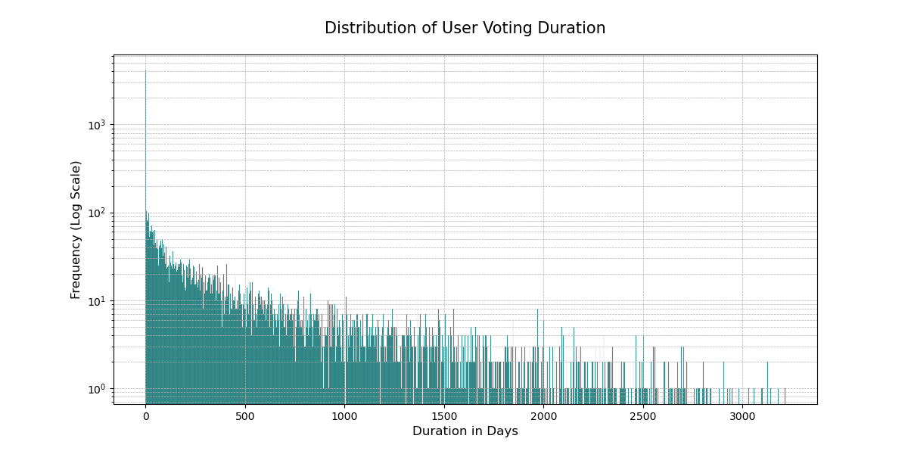
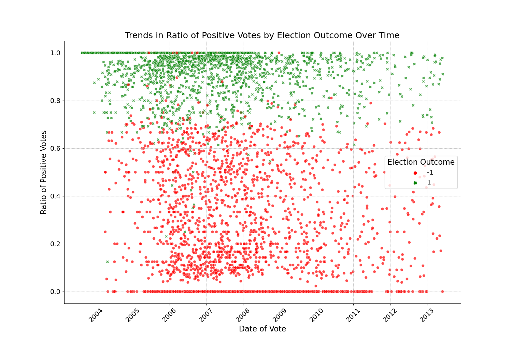

# Background and motivation

Wikipedia, the world's largest online encyclopedia, relies on a community of dedicated contributors to maintain and improve its vast repository of knowledge. Admins (short for administrators) play a crucial role in this ecosystem by overseeing the platform, ensuring its integrity, and facilitating a collaborative and respectful environment for editors. The process through which individuals become administrators is known as the Request for Adminship (RfA). Adminship is not just a privilege but a responsibility, and those seeking this role are expected to have a deep understanding of Wikipedia policies, guidelines, and a history of constructive contributions. All the admins have the ability to delete pages, protect pages from editing, and block users, among other tools. Those tasks necessitate a high level of trust from the community, hence, the importance of robust votations in Wikipedia's administrative elections cannot be overstated. They need to ensure a fair and equitable system. The essence of Wikipedia lies in its commitment to democratic principles, where decisions affecting the community are made collectively. The participation of a diverse and substantial voter base ensures that the outcome is reflective of the broader community's values, preferences, and expectations. A multitude of voters brings a diverse range of perspectives, mitigating the risk of undue influence or bias. The votation process is a crucial mechanism for upholding fairness, transparency, and community consensus, reinforcing Wikipedia's commitment to providing a collaborative platform.

Considering these factors, it is anticipated that candidates would be driven by a commitment to actively engage in the election process and uphold the democratic values ingrained in Wikipedia's governance structure. Their objective should be to ensure that candidates are selected on the basis of their merit, experience, and dedication to the fundamental principles of Wikipedia. However, is it really the case?

In this data story, we aim to address the following questions:

- Is the election process as fair as it should ideally be ?
- What drives people to vote ?
- How could the Wikipedia democratic process be improved ?

Only a small fraction of wikipedia users vote in the 'request for adminship' (RfA) elections, although admins hold the key to maintaining the integrity and functionality of the world's largest online encyclopedia. From 2003 to 2013, there is an average of 53 votes per election out of the millions of registered users that are allowed to vote on Wikipedia from 2003 to 2013. This low number raise some concerns for the platform's democratic processes and its robustness. A small number of voters may not accurately represent the diverse opinions and perspectives within the Wikipedia community.

Our aim is to investigate the factors influencing participation and identify the challenges that arise from the low engagement rate. Based on our research, we intend to propose solutions to increase the participation rate.

We will study the reasons that push people to go out of their way to vote, whether it is to support someone they know, to support a community they are a part of, to support someone that share the same interests or to reject someone from an opposing group.

# The data used

## Wikipedia Requests for Adminship (Wiki-RfA)

Our main dataset, the [Wiki-RfA](https://snap.stanford.edu/data/wiki-RfA.html "hello"), gives insights on the social and administrative mechanisms of Wikipedia. Spanning from 2003 to 2013, it includes a collection of 11,381 users involved in RfA processes, resulting in 189,004 unique voter/votee pairs and 198,275 votes. This dataset offers a detailed view into Wikipedia's community dynamics, reporting each vote, election outcome, and user comment. This rich data allowed us to dive into the online collaborative decision-making process, highlighting the interplay of social dynamics and governance within the Wikipedia community.

### Preprocessing

To analyze this intricate network, we constructed a directed graph. Here, each node represents a Wikipedia user, and each directed edge maps a voting action. This graph structure was essential for our analysis, enabling us to understand the directional flow of influence and support among users.

| Network Statistics      |  Value  |
| ----------------------- | :-----: |
| Nodes (Users)           | 10,835  |
| Edges (Votes)           | 159,388 |
| Triangles (Connections) | 956,428 |

## Complete Wikipedia Edit History (Up to Jan 2008)

Our second dataset, the [Complete Wikipedia Edit History](https://snap.stanford.edu/data/wiki-meta.html), provided a contrasting but complementary perspective. This dataset is a vast repository containing several terabytes of text, capturing the entire edit history of Wikipedia articles up to January 2008. It is divided into several components, showcased in the following table, each representing different facets of Wikipedia.

| File                           | Description                         | Size  |
| ------------------------------ | ----------------------------------- | ----- |
| Main Namespace Revisions       | Core Wikipedia articles             | 8Gb   |
| Talk Namespace Edits           | Article discussion pages            | <1 GB |
| User Page Revisions            | User personal pages                 | <1 GB |
| User Talk Page Edits           | User discussion pages               | <1 GB |
| Wikipedia Namespace            | Administrative procedures and pages | 3Gb   |
| Wikipedia Namespace Talk Pages | Administrative discussion pages     | <1 GB |

In our project, we focused on the Main Namespace Revisions and User Talk Page Edits to track and analyze user interactions. This selection was made considering our objective to study RfA voting patterns and collaborative editing behaviors.

### Preprocessing

Our analytical approach involved narrowing down the dataset to include interactions only between users present in the Wiki-RfA dataset. This filtering significantly reduced the dataset size, making it more manageable for our study. Subsequently, we created a new dataset capturing the number of interactions between each user pair, considering both direct communications on user talk pages and joint revisions of Wikipedia articles. This approach provided us with a comprehensive view of user interaction dynamics in the Wikipedia community.

# Elections Dynamics

Our dataset is not just a collection of numbers, it is a reflection of the motivations and actions of voters within the RfA process. As we want to delve into the intricacies of voting behavior in RfA Elections, let's first start with some foundational statistics about the elections and their outcome.

First, we observe that a majority of votes are positive.

<iframe src="assets/html/vote_percentage.html" width="750px" height="530px" frameborder="0" position="relative">Genre plot</iframe>

How about the distribution of the number of votes ? Do people have a tendency to vote in every election or only sporadically ?

 

From the graph, we see a long-tail distribution of voter activity, indicating that a small number of people vote a lot, while most people only engage in the elections minimally.

The plot of the duration between users’ first and last votes confirms that most people briefly participate in elections, while a minority stays active longer.

Now, if we look at the ratio of positive votes by election outcome over time, we observe that there is a correlation between the two. Indeed, there seems to be a specific threshold for the percentage of positive votes for an election to be successful.

As we wanted to have more information about these elections, we added additional datasets for our analysis. We added the Wikipedia

The other dataset comprises the edits on different Wikipedia pages. From that, we can gather the pages edited by a user, to identify their centers of interest, and compare them with other users. If their interests are similar enough, we will consider that these users are part of the same community.

<iframe src="assets/html/menu.html" width="750px" height="530px" frameborder="0" position="relative">Genre plot</iframe>

